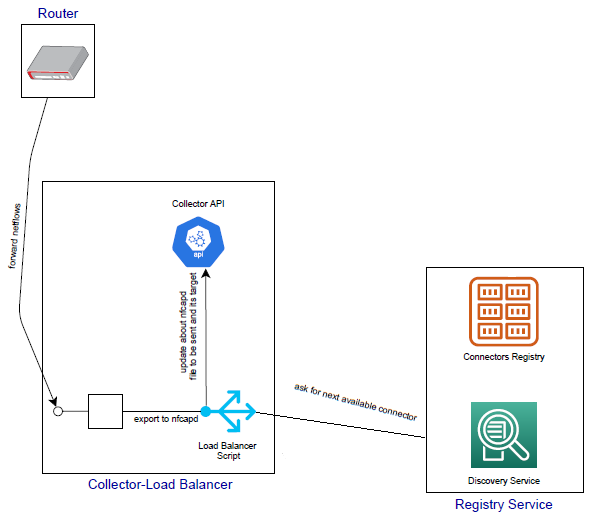

## Netflow Collector - Load Balancer

- Forwarded netflows will be collected using nfcapd tool.
- Directory where nfcapd files are dumped is monitored for new files.
- When a new nfcapd file is moved to this directory, this file must be sent to an available connector in order to be ingested in Kafka.
- This service communicates with Registry Service in order to fetch the endpoint of an available collector.
- The collected nfcapd file is sent to the available connector.
- When the file is sent, it is deleted.
- Also a benchmark provided, which dumps to a file the timestamps when the file are detected and sent to connectors. Along with benchmark modes from another components, it can be used in order to extract some metrics about the performance of the complete pipeline.

## Architecture



## Local Deployment

### Prerequisities
- Python.
- Install all Python packages from requirements.txt
```
pip install -r requirements.txt
```
- Packages inotifywait and nfdump. These packages are available in almost all Linux distros. For Ubuntu distros if they are not installed they will be installed during start of the service.

### Deployment commands
Deployment of this servive needs administrator privileges (sudo).

```
./start_netflow_orchestrator.sh
```

## Dockerized Deployment
The Netflow Collector - Load Balancer service can also be deployed as docker container.

### Deployment commands
```
docker build -t collector-lb-app:v1.0 -f Dockerfile-CollectorLBService ./
docker tag collector-lb-app:v1.0 10.101.10.244:5000/collector-lb-app:v1.0
docker push 10.101.10.244:5000/collector-lb-app:v1.0
```

Deploy in k8s cluster

```
kubectl create -f deployment.yaml
```

### Docker ENV variables
Any needed configuration for the service is configured with Docker ENV variables:
- **NFCAPD_PORT**: Port where nfcapd will listens to for new netflows. Default: 9999.
- **NFCAPD_INTERVAL_SECONDS**: How often nfcapd will dump collected netflows to nfcapd files (in seconds). Default: 60.
- **REGISTRY_IP**: IP where Registry service is running. Default: localhost.
- **REGISTRY_PORT**: Port where Registry service is listening to. Default 5000.
- **BENCHMARK_MODE**: Run in benchmark mode. Default: false.