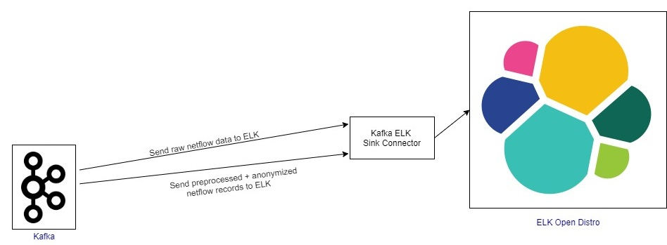

## Raw & Preprocessed Netflow Data Store To Elastic From Kafka (Sink Connector)



## Local Deployment

- The two required indexes will be created in startup, if they are not exist. These indexes are used for storing raw and
  preprocessed netflow data. If ingestion of raw netflows is disabled, only preprocessed netflow data will be stored in
  Elastic.
- Ingested netflow data (raw & preprocessed), will be converted from csv format in json format.
- Each ingested netflow record will be parsed, so it validates the csv schema for incoming netflows. There are two files
  that defines this schema in resources folder, one for raw netflow data (csv-raw-schema.json) and one for preprocessed
  netflow data (csv-preprocessed-schema.json).
- In converted JSON format, the flows will be labeled as internal, external, inbound or outbound. For this labelling,
  there is a txt files in resources folder, which defines which subnets will be labeled as internal subnets, so their
  IPs will be marked as internal IP addresses (subnets.txt). Every other IP, that is not included in one of these
  subnets will be used as external IP address.
- For this conversion there is a mapping file for raw netflow data (csv-json-mapping-raw.json) and preprocessed netflow
  data (csv-json-mapping-preprocessed.json) in resources folder. These files maps each csv column (by name) with a
  category and a sub-category key name, that will be used in converted JSON format.
- Converted json will be inserted as a new document in Elastic in the appropriate index (index for raw or preprocessed
  netflow data).

### Prerequisities

- Change any needed configuration in .properties file of Elastic Sink Connector (elastic-sink.properties):
    - **name**: Connector's name.
    - **connector.class**: Main Class of Sink Connector. Must **NOT** be changed, unless another class implementing
      logic for Sink Connector.
    - **tasks.max**: How many tasks of the connector will be running. Must **NOT** be changed.
    - **topics**: A string containing all Kafka topics (comma separated), that the connector will retrieve data from.
      For this connector, two topics are required. One topic where raw netflow data will be ingested and one, where all
      preprocessed netflow data will be ingested from preprocessing pipeline.
    - **kafka.topic.sink.netflow.raw**: Kafka topic, that will be used for raw netflow data.
    - **kafka.topic.sink.netflow.preprocessed**: Kafka topic, that will be used for preprocessed netflow data.
    - **elastic.host.ip**: Ip of the host, where Elastic runs.
    - **elastic.host.port**: Port, where Elastic listens to.
    - **elastic.authentication.username**: Username for Elastic authentication.
    - **elastic.authentication.password**: Password for Elastic authentication.
    - **elastic.indexes.netflow**: Elastic indexes, that will be used for data storage. In this configuration two
      indexes are required, one for storing raw netflow data and the other for storing preprocessed netflow data.
    - **elastic.index.netflow.raw**: Elastic index, that will be used for raw netflow data.
    - **elastic.index.netflow.preprocessed**: Elastic index, that will be used for preprocessed netflow data.
    - **elastic.indexes.shards**: Number of shards for new created indexes.
    - **elastic.indexes.partitions**: Number of partitions for new created indexes.
    - **connector.sink.netflow.raw**: A boolean that defines if the raw netflow data will also be ingested in Elastic (
      Default: false).
- Fill the files subnets.txt with all internal subnets, following the format SUBNET_IP/SUBNET_MASK.
- Copy csv-json-mapping-raw.json, csv-json-mapping-preprocessed.json, csv-raw-schmea.json, csv-preprocessed-schema.json
  for Elastic Sink Connector, where the jar is saved. These files will be used for parsing csv records and convert them
  to JSON format, in order to be stored in Elastic.
- Copy subnets.txt, where the .jar is deployed. This file contains all subnets that are considered as internal subnets.
- Copy log4j.properties, where the .jar is deployed. These are some configuration about the application logging.

## Dockerized Deployment

- The two required indexes will be created in startup, if they are not exist. These indexes are used for storing raw and
  preprocessed netflow data. If ingestion of raw netflows is disabled, only preprocessed netflow data will be stored in
  Elastic.
- Ingested netflow data (raw & preprocessed), will be converted from csv format in json format.
- Each ingested netflow record will be parsed, so it validates the csv schema for incoming netflows. There are two files
  that defines this schema in resources folder, one for raw netflow data (csv-raw-schema.json) and one for preprocessed
  netflow data (csv-preprocessed-schema.json).
- In converted JSON format, the flows will be labeled as internal, external, inbound or outbound. For this labelling,
  there is a txt files in resources folder, which defines which subnets will be labeled as internal subnets, so their
  IPs will be marked as internal IP addresses (subnets.txt). Every other IP, that is not included in one of these
  subnets will be used as external IP address.
- For this conversion there is a mapping file for raw netflow data (csv-json-mapping-raw.json) and preprocessed netflow
  data (csv-json-mapping-preprocessed.json) in resources folder. These files maps each csv column (by name) with a
  category and a sub-category key name, that will be used in converted JSON format.
- Converted json will be inserted as a new document in Elastic in the appropriate index (index for raw or preprocessed
  netflow data).

### Deployment commands

Build with,

```
docker build -t elastic-sink-connector:v1.0 -f ./Dockerfile ./
docker tag elastic-sink-connector:v1.0 10.101.10.244:5000/elastic-sink-connector:v1.0
docker push 10.101.10.244:5000/elastic-sink-connector:v1.0
```

Deploy with,

```
kubectl create -f deployment.yaml
```

### Docker ENV Variables

Any needed configuration for the connector is configured with Docker ENV variables:

- **KAFKA_IP**: IP address of Kafka bootstrap server.
- **KAFKA_PORT**: Port of Kafka bootstrap server.
- **RAW_SINK_TOPIC**: Kafka topic name to fetch raw netflow data from and send them to Elastic.
- **PREPROCESSED_SINK_TOPIC**: Kafka topic name to fetch preprocessed netflow data from and send them to Elastic.
- **ELASTIC_IP**: Ip address of Elasticsearch.
- **ELASTIC_PORT**: Port, where Elasticsearch listens to.
- **ELASTIC_USER**: Elastic account username.
- **ELASTIC_PASS**: Elastic account password.
- **ELASTIC_INDEX_SHARDS**: Number of Elastic index shards.
- **ELASTIC_INDEX_PARTITIONS**: Number of Elastic index partitions.
- **RAW_ELASTIC_INDEX**: Name of Elastic index for saving raw netflow data.
- **PREPROCESSED_ELASTIC_INDEX**: Name of Elastic index for saving preprocessed netflow data.