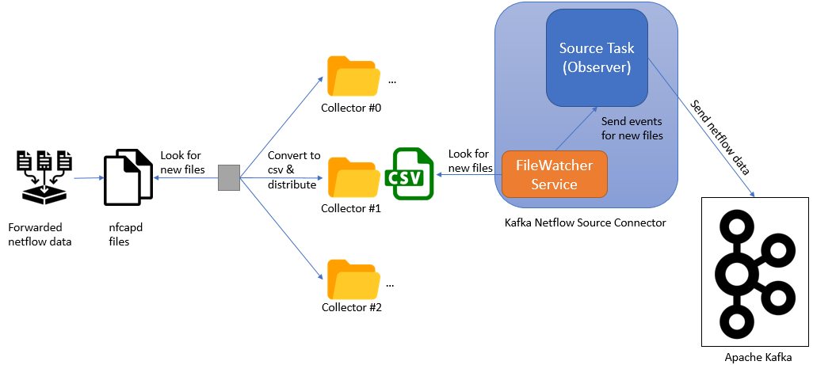
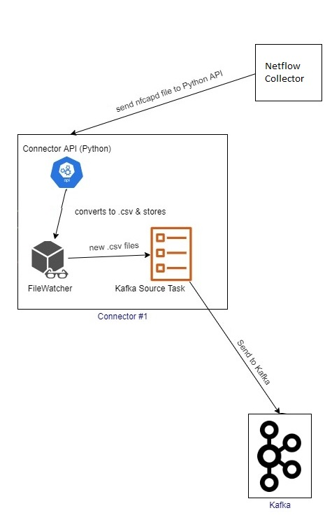

## Raw Netflow Data Ingestion To Kafka (Source Connector)

## Local Deployment



- Forwarded netflow data will be collected using nfcapd tool.
- Netflow will be saved in nfcapd format in a specific directory.
- There is a process running (**NetflowLoadBalancer**), which monitors the directory where nfcapd files are exported for
  new files, *i.e. /home/palantir-netflows/*.
- In this directory there is a separate folder for each connector process running. The name of these separate folders
  are same with each collector's id, *i.e. for connector with id equal to 5, this directory will be
  /home/palantir-netflows/5/*.
- **NetflowLoadBalancer** is responsible for equally distributing all produced nfcapd files in all running connectors,
  applying round-robin distribution.
- During the distribution **NetflowLoadBalancer**, also converts nfcapd in .csv file. It sends .csv file to each
  collector's directory, and deletes existing nfcapd files. The name of the exported .csv will the format
  nfcapd.YYYYMMDDhhmmss.csv.
- NetflowCsvSourceConnector follows the Observer design pattern and consists of two main components: **FileWatcher**
  service (Subject) & **Source Task** (Observer).
- **FileWatcher** monitors the connector's directory. It uses a file to save the name of last collected netflow file.
  Because of the extracted .csv names, they can be filtered in ascending order using the data, and retrieve only the
  newest files, that have not been processed. For each new file the **FileWatcher** send an event with the name of the
  new observed file.
- **SourceTask** implements a listener, and is registered to **FileWatcher's** events. When the implemented listener
  receives a new event, **SourceTask** opens the .csv file and creates a new Record for each line in this. When the file
  is parsed all these records are send to the responsible Kafka topic.
- Each Kafka record will be sent with a unique key, and the line from .csv is its value,

### Prerequisities

Change any needed configuration in .properties file of Netflow Source Connector (netflow-source-linux.properties OR
netflow-source-windows.properties):

- **name**: Connector's name.
- **connector.class**: Main Class of Source Connector. Must **NOT** be changed, unless another class implementing logic
  for Source Connector.
- **tasks.max**: How many tasks of the connector will be running. Must **NOT** be changed.
- **kafka.topic.source**: Kafka topic, where collected netflows will be dumped into.
- **collector.id**: Id of the collector. Must be unique for each collector process runing in same machine.
- **data.dir.file.prefix**: Prefix of file, where last read netflow filename will be saved. This file will be saved in
  /var/tmp/Palantir/ in Linux or in %APPDATA%/Local/Temp/Palantir/ in Windows.
- **filewatcher.dir.observe**: The directory path, which FileWatcher service will be looking for new files. This must be
  a subdirectory of the directory, which NetflowLoadBalancer observes and its name must be equal to the collector.id
  property. For example: If main directory, which NetflowLoadBalancer observes is /home/palantir-netflows/ and
  collector.id=5, the ***filewatcher.dir.observe=/home/palantir-netflows/5/***
- **filewatcher.interval.s**: Time interval (in seconds) for FileWatcher service to check for new files.

## Dockerized Deployment



- A Python process is starting, when the created container is started. Python is responsible for registering this
  connector with Registry service, periodically updates its status and un-register it when the container will be
  stopped.
- Collected netflows are sent from Collector to this connector, through its Python API. The sent files are in .nfcapd
  format.
- Received netflow files will be converted in csv and saved in a specific directory, *i.e.
  /home/kafka-source-connector/collected_files_csv/*.
- There is a process running (**NetflowLoadBalancer**), which monitors the directory where the converted csv files are
  stored for new files.
- NetflowCsvSourceConnector follows the Observer design pattern and consists of two main components: **FileWatcher**
  service (Subject) & **Source Task** (Observer).
- **FileWatcher** monitors the connector's directory. It uses a file to save the name of last collected netflow file.
  Because of the extracted .csv names, they can be filtered in ascending order using the data, and retrieve only the
  newest files, that have not been processed. For each new file the **FileWatcher** send an event with the name of the
  new observed file.
- **SourceTask** implements a listener, and is registered to **FileWatcher's** events. When the implemented listener
  receives a new event, **SourceTask** opens the .csv file and creates a new Record for each line in this. When the file
  is parsed all these records are send to the responsible Kafka topic.
- Each Kafka record will be sent with a unique key, and the line from .csv is its value.

### Deployment commands

```
docker build -t netflow-source-connector:v1.0 -f ./Dockerfile ./
docker tag netflow-source-connector:v1.0 10.101.10.244:5000/netflow-source-connector:v1.0
docker push 10.101.10.244:5000/netflow-source-connector:v1.0
```

```
kubectl create -f deployment.yaml
```

### Docker ENV variables

Any needed configuration for the connector is configured with Docker ENV variables:

- **KAFKA_IP**: Kafka Bootstrap server
- **KAFKA_PORT**: Kafka port
- **NAME**: Name of the connector. This must be unique among all connectors
- **API_PORT**: Port, where Connector Python API, will listens to
- **REGISTRY_IP**: IP of registry service
- **REGISTRY_PORT**: Port, where registry service listens to
- **UPDATE_INTERVAL**: Time interval (in seconds) that connector will update its status in registry Service